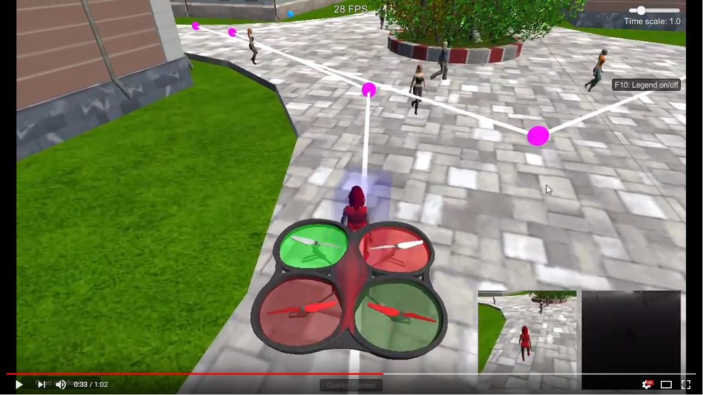

[](https://www.udacity.com/robotics)

## Deep Learning Project ##

[image_0]: ./docs/misc/sim_screenshot.png
![alt text][image_0] 


The Udacity Robotics Software Engineer Nanodegree :: Deep Learning Project is a Follow Me Quadcopter Drone Project. It utilizes a Fully Connected Convolutional Neural Network (FCN) in Tensorflow and Keras to build a model that identifies, targets and tracks a person from a Simulation Drone Camera feed built in Unity3D. The simulated Drone must acquire and follow a target person while ignoring other people that are randomly spawned around the target person.

Below is a video of how the final target tracking runs in the QuadSim simulator. It has an average IoU of 42%.

[](https://www.youtube.com/watch?v=LM8i6oglozw)

### Architecture ###

The model has to be able to segment out objects within a live video stream which means that every pixel in the still frame image needs to have a label. Semantic Segmentation is a technique used with a Fully Convolutional Network to achieve this result. At the end of the process every pixel will be colored in one of the segmentation colors.


#### Convolutional Neural Network ####
Connvolutional Neural Networks (CNN) are widely used and perform very well in imaging applications due to the way that they mimic the human visual perception system and the visual cortex. Local regions of information are extracted from imagery by stacking feature extraction layers which detect higher and higher level information from an image. Edges, curves, shapes, etc. Traditional CNNs perform very well for Image Classification but due to the Fully Connected Layers placed at the end of the network aren't very good at positional information of the objects detected in the images. Spatial information required to locate objects is removed.

[image_17]: ./images/cnn_architecture.jpg
![alt text][image_17]


#### Fully Convolutional Network ####

[image_5]: ./images/FCN.png
![alt text][image_5]
Image Credit: http://cvlab.postech.ac.kr/research/deconvnet/

**1x1 convolutional layers:**

In order to preserve spatial information, the Fully Connected Layers in a CNN can be replaced with 1x1 Convolution Layers. Low dimensional embeddings (1x1 convolutions) can contain quite a bit of information about a larger image. There are also advantages to 1x1 convolution layers like being able to feed images of any size into the network as well as increasing or decreasing the complexity in the filter space. In particular here they can reduce the dimensionality in the filter dimension while retaining the spatial information.

A disadvantage of 1x1 layers is that they can be computationally slower than Fully Connected layers, so we need to keep that in mind as well.

**Encoding**

Like typical CNNs reducing the height and width with each added convolution layer with a stride larger than 1 extracts higher and higher level information from an image while the depth of the output is also increased so we don't lose information. This is where the 1x1 convolutional layers retain some spatial information that we can use in predictions.

**Decoding**

The decoding process is a transposed encoding process (or deconvolution) with an upsampling process. This operation goes in the opposite direction to a convolution and translates the activations into meaningful information that scales up the activation to the same image size. This results in a pixel by pixel segmentation of the original input image. Within the decoder blocks, we restore the spatial size using Bilinear Upsampling. We also use Skip Connections with lower level information from prior layers that improves accuracy. Convolution layers in the decoder blocks can also extract information from prior layers.

**Bilinear Upsampling**

Bilinear Upsampling allows us to predict pixel image probability from spatial information. Less training is required compared to transpose convolutions because Bilinear Upsampling is a linear interpolation of values.

**Skip Connection**

Skip Connections are a powerful tool in our arsenal that combines the high-level and low-level information to make spatial predictions more accurate. Prior layers with the same height and width are Concatenated and a Convolution is performed.

**Separable Convolutions and Batch Normalization**

The input batch of each layer is optimized by normalization using the provided functions **separable_conv2d_batchnorm** as a separable dimensional convolution with ReLU activation and **conv2d_batchnorm** as a normal 2d convolution with ReLU activation. This allows convergence more quickly by helping Gradient Descent. The Depthwise Separable Convolution layers perform convolution on each of the input channels followed by a 1x1 convolution on the result. Reducing parameters improves performance and also reduces overfitting.

**Building the Model**

The steps to build the model are:

 * Create an Encoder block
 * Create a Decoder block
 * Build the FCN of Encoder blocks, 1x1 convolution and Decoder blocks
 
The Encoder block is a separable convolution layer using the ```separable_conv2d_batchnorm()``` function

```python
def encoder_block(input_layer, filters, strides):
    
    # TODO Create a separable convolution layer using the separable_conv2d_batchnorm() function.
    output_layer = separable_conv2d_batchnorm(input_layer, filters, strides)
    
    return output_layer
```

The Decoder block has 3 parts:

 * A bilinear upsampling layer using the ```upsample_bilinear()``` function
 * Layer concatenation
 * Several separable convolution layers to extract more spatial information from prior layers

```python
def decoder_block(small_ip_layer, large_ip_layer, filters):
    
    # TODO Upsample the small input layer using the bilinear_upsample() function.
    output_layer = bilinear_upsample(small_ip_layer)
    
    # TODO Concatenate the upsampled and large input layers using layers.concatenate
    output_layer = layers.concatenate([output_layer, large_ip_layer])
    
    # TODO Add some number of separable convolution layers
    output_layer = separable_conv2d_batchnorm(output_layer, filters)
    output_layer = separable_conv2d_batchnorm(output_layer, filters)
    output_layer = separable_conv2d_batchnorm(output_layer, filters)
    
    return output_layer
```

**The FCN Model**

There are 3 steps in building the FCN Model:

 * Encoder block to build the encoder layers
 * 1x1 Convolutional layer using the ```conv2d_batchnorm()``` function with kernel size and stride of 1
 * Same number of encoder and decoder blocks to recreate the original image size

```python
def fcn_model(inputs, num_classes):
    
    # TODO Add Encoder Blocks. 
    # Remember that with each encoder layer, the depth of your model (the number of filters) increases.
    encoder1 = encoder_block(inputs, filters=32, strides=2)
    encoder2 = encoder_block(encoder1, filters=64, strides=2)
    encoder3 = encoder_block(encoder2, filters=64, strides=2)
    
    # TODO Add 1x1 Convolution layer using conv2d_batchnorm().
    conv1 = conv2d_batchnorm(encoder3, filters=64)
    
    # TODO: Add the same number of Decoder Blocks as the number of Encoder Blocks
    decoder1 = decoder_block(conv1, encoder2, filters=64)
    decoder2 = decoder_block(decoder1, encoder1, filters=64)
    x = decoder_block(decoder2, inputs, filters=32)
    
    # The function returns the output layer of your model. "x" is the final layer obtained from the last decoder_block()
    return layers.Conv2D(num_classes, 1, activation='softmax', padding='same')(x)
```
**The network has the following layers:**

 * Input layer (Channels = 3 (RGB))
 * 3 Encoder layers (Channels = 32, 64, 128)
 * 1x1 Convolution layer (Channels = 256)
 * 3 Decoder layers (Channels = 128,64,32)
 * Output layer (Channels = 3 (Hero, Human, Background))

Below is the keras model from plot_model(model, to_file='model.png')

[image_16]: ./images/model.png
![alt text][image_16]


#### Training ####

I trained my FCN locally with tensorflow-gpu on a Quadro M1200 and the speed were adequate enough to get an acceptable result without going to the AWS instance with Tesla K80. It required the batch size to not be too high and get an out of memory error but still yieled an acceptable result. When I have more time I will try to get a higher final result and IoU with a faster workstation.

Batch size was a balancing act as higher sizes could overflow CPU and GPU cache and writing to system RAM which slows the process down.

Number of epochs increases model accuracy but after 10 the accuracy didn't improve as much.

I found a good balance in the steps per epoch and validation steps in 200 and 50. If it was doubled the training time doubled but marginal increases in accuracy were achieved. If it was 100 and 25 (/2) there was a huge decrease in accuracy.

Here are my training epochs from these Hyperparameters:

```python
learning_rate = 0.005
batch_size = 30
num_epochs = 10
steps_per_epoch = 200
validation_steps = 50
workers = 2
```

[image_2]: ./images/sem_seg_epochs_01.jpg
![alt text][image_2]

[image_3]: ./images/sem_seg_epochs_02.jpg
![alt text][image_3]

[image_4]: ./images/sem_seg_epochs_03.jpg
![alt text][image_4]


### Prediction ###

Once the model is trained it's time to make Predictions. There are three types of images available from the validation set:

```
patrol_with_targ: Test how well the network can detect the hero from a distance.
patrol_non_targ: Test how often the network makes a mistake and identifies the wrong person as the target.
following_images: Test how well the network can identify the target while following them.
```

#### following_images ####

[image_6]: ./images/following_01.png
![alt text][image_6]

[image_7]: ./images/following_02.png
![alt text][image_7]

[image_8]: ./images/following_03.png
![alt text][image_8]

#### patrol_with_targ ####

[image_9]: ./images/following_withtarget_01.png
![alt text][image_9]

[image_10]: ./images/following_withtarget_02.png
![alt text][image_10]

[image_11]: ./images/following_withtarget_03.png
![alt text][image_11]

#### patrol_non_targ ####

[image_12]: ./images/following_notarget_01.png
![alt text][image_12]

[image_13]: ./images/following_notarget_02.png
![alt text][image_13]

[image_14]: ./images/following_notarget_03.png
![alt text][image_14]


### Evaluation ###

The final score of my model was 0.424, and the final IoU without the target was 0.550.

[image_15]: ./images/evaluation.jpg
![alt text][image_15]

### Future Enhancements ###

A few methods could be utilized to improve the final score:

1. Increase the resolution of the images: Increasing the resolution of the images would help especially in cases where the target is far away. This would significantly increase the training time and performance so it may not be ideal for using in a real time situation like a drone where the compute power per watt is an issue.

2. Increase the number of images in the dataset: Increasing the number of images in the dataset would likely help, but there could be a tradeoff between under and overfitting. This would need to be tested by taking more images from the drone for training and validation.

3. Increase the batch size in the hyperparameters for each single pass: I didn't have enough memory to increase the Batch Size per pass, but it would probably help in accuracy up to a point. This would also need to be tested on a machine with more power.

Additional enhancements: For this example, the model was trained on humans but it could be repurposed to recognize things like vehicles or animals. It wouldn't work very well if you just fed it new images, the model would need to be trained and validated on images from the ground up with a large, good dataset such as CIFAR-10.
